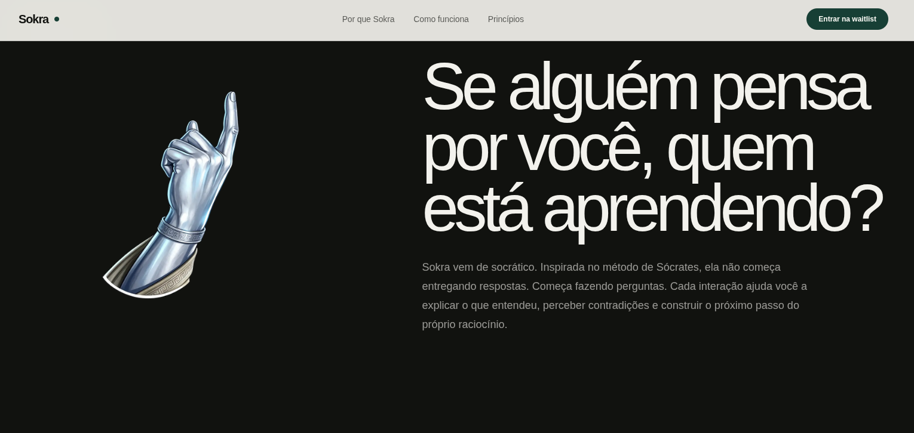

# Sokra

> Aprender começa com uma boa pergunta.

 
    

O Sokra é um tutor de estudos baseado no método socrático.
Em vez de entregar respostas imediatamente, ele ajuda o estudante
a desenvolver o próprio raciocínio por meio de perguntas orientadas.

## Problema

Ferramentas tradicionais de IA frequentemente transformam o estudo
em um processo passivo: o estudante pergunta e recebe uma resposta pronta.

## Proposta

O Sokra conduz o aluno por uma sequência de perguntas, registra dificuldades
recorrentes e adapta as interações com base no histórico de aprendizagem.

## Funcionalidades planejadas

- Conversas orientadas pelo método socrático
- Memória persistente do estudante
- Identificação de lacunas de conhecimento
- Histórico e acompanhamento de evolução
- Interação por texto e voz
- Revisões personalizadas

## Status

MVP em desenvolvimento

### Em andamento

- [x] Landing page
- [x] Lista de espera
- [x] Estrutura inicial do monorepo
- [ ] Autenticação
- [ ] Perfil do estudante
- [ ] Fluxo socrático inicial
- [ ] Memória persistente

## Arquitetura

Breve explicação da divisão entre frontend, backend, banco de dados e LLM.

## Decisões técnicas

As principais decisões arquiteturais estão documentadas em `docs/decisions`.

## Roadmap

- v0.1 — Landing page e validação da proposta
- v0.2 — Autenticação e perfil do estudante
- v0.3 — Primeira conversa socrática
- v0.4 — Memória persistente
- v0.5 — MVP para testes

## Autor

Desenvolvido por Pedro Gonçalves.